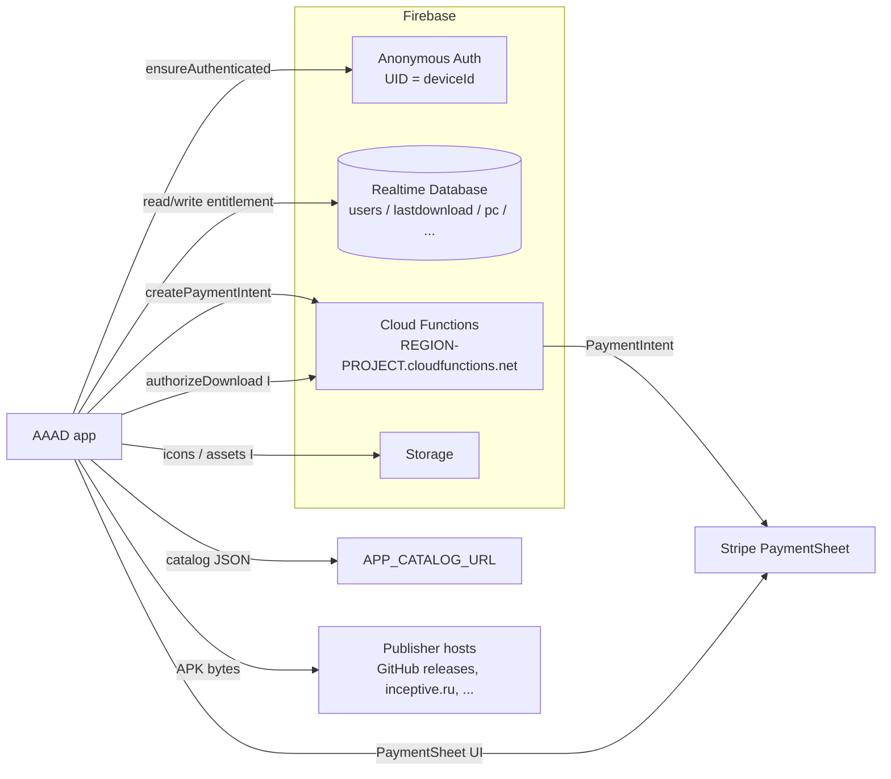
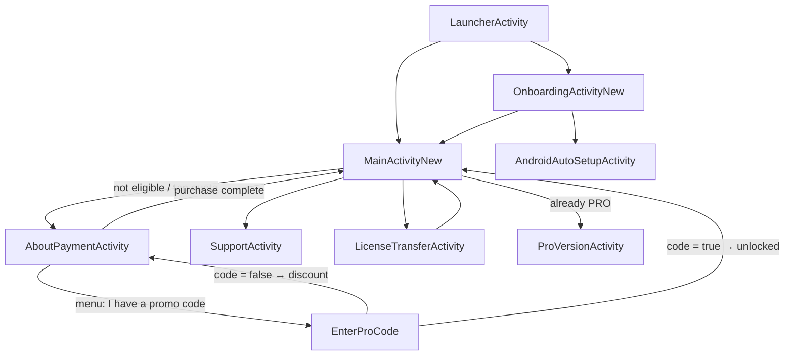

# AAAD — Architecture Spec (as of fork point `0c33a2b`)

Describes the app **as this repository actually stands**, not as it would stand after the fork
work in [TASKS.md](TASKS.md).

## Evidence policy

Upstream publishes a partial source drop, so a full description cannot come from source alone.
Every non-obvious claim below carries a tag:

- **[V]** Verified — read directly from a file in this repo (path:line given) or from git history.
- **[H]** Historical — verified in `b5198bb` ("Source code version 1.3", 2021-05-12), which still
  ships `MainActivity.java`. Accurate for 1.3; superseded in 2.1 where noted.
- **[I]** Inferred — deduced from the manifest, `res/` strings, or the dependency set. Not read
  from source. Treat as a hypothesis to confirm, and cite the evidence when you do.

---

## 1. What the app does

1. Shows a catalog of third-party Android Auto apps (mirroring, media, browsers, gauges).
2. Downloads the chosen APK from its original publisher.
3. Hands it to the platform installer in a way that makes Android Auto list it — historically by
   setting `EXTRA_NOT_UNKNOWN_SOURCE` and claiming `com.android.vending` as the installer package
   **[H]** `MainActivity.java:1469-1473`; on Android 14+ optionally via Shizuku **[I]**.
4. Meters step 2: free users get one download per ~30.44 days; PRO users are unlimited.

Everything in this document that matters for the fork is step 4 — see §7.

## 2. Component inventory

`AndroidManifest.xml` declares 12 app components — 11 activities and 1 receiver; the two
`<provider>` entries are library classes (androidx `FileProvider`, `rikka.shizuku.ShizukuProvider`)
and need no source here. Source exists for 4 of the 12.

| Component | Source | Role |
| --- | --- | --- |
| `LauncherActivity` | **absent** | `MAIN`/`LAUNCHER` entry; routes to onboarding or main **[I]** |
| `MainActivityNew` | **absent** | Material You catalog screen; also handles the `inceptive.ru/projects/s2a/download/` deep link for Screen2Auto **[V]** manifest:132-139 |
| `OnboardingActivity` | **absent** | Legacy single-page onboarding |
| `OnboardingActivityNew` | **absent** | Multi-page onboarding: permissions, Play Protect, Shizuku **[I]** from `strings.xml:37-109` |
| `AndroidAutoSetupActivity` | **absent** | Guide for enabling AA developer settings **[I]** `strings.xml:316-333` |
| `AboutPaymentActivity` | `.kt`, 384 ln | PRO purchase: Stripe PaymentSheet + Cloud Function |
| `ProVersionActivity` | **absent** | Post-purchase thank-you / benefits screen **[I]** `strings.xml:285-297` |
| `EnterProCode` | `.java`, 125 ln | Promo-code redemption |
| `TransferLicense` | `.java`, 242 ln | Legacy QR license transfer |
| `LicenseTransferActivity` | **absent** | Modern replacement for the above **[I]** `strings.xml:217-249` |
| `SupportActivity` | **absent** | Help/e-mail with optional diagnostic log attachment **[I]** `strings.xml:251-273` |
| `receivers.PackageInstallReceiver` | **absent** | `PACKAGE_ADDED/REMOVED/REPLACED` → refresh install state |

Support classes referenced but absent: `managers.AuthManager`, `utils.Logger`,
`utils.applyBottomInsetPadding` **[V]**. Present support classes: `utils/BottomDialog.java`
(vendored fork of iGio90/BottomDialogs, re-skinned to app colors), `utils/UtilsLibrary.java`,
`utils/Version.java` (dotted-version comparator for the self-updater), `AboutDialog.java`,
`User.java` (a dead 12-line stub — nothing references it).

The `res/` tree is complete for the published classes: every layout id and string they reference
resolves. Resources for the absent activities are also largely present, which makes `strings.xml`
the best available specification of the missing code.

## 3. Build configuration **[V]**

| Setting | Value |
| --- | --- |
| AGP / Kotlin / google-services | 8.13.1 / 2.2.21 / 4.4.3 (`build.gradle:8-11`) |
| `applicationId` | `sksa.aa.customapps` (namespace differs: `com.legs.appsforaa`) |
| compileSdk / targetSdk / minSdk | 36 / 36 / 24 (24 is a Shizuku floor, `app/build.gradle:81`) |
| versionName / versionCode | 2.1 / 18 |
| Java / JVM target | 11 |
| Signing | Single `nuova` config, keystore path + passwords from `local.properties`, `keyAlias 'key3'` |
| Release build | `minifyEnabled false` — the shipped APK is unobfuscated |
| Lint | `abortOnError false`; `MissingTranslation` and `ImpliedQuantity` disabled |

`app/build.gradle:89-103` injects **15 `buildConfigField` values from `local.properties`** — the
file is read unconditionally at `:47`, so its absence fails configuration outright:

`STRIPE_PUBLISHABLE_KEY` · `STRIPE_PRICE_ID` · `STRIPE_PRICE_ID_PROMO` · `FIREBASE_INSTANCE` ·
`FIREBASE_PROJECT_ID` · `FIREBASE_REGION` · `APP_CATALOG_URL` · and eight per-app APK links
(`AAPASSENGER_LINK`, `CARSTREAM205_LINK`, `CARSTREAM204_LINK`, `CARSTREAM202_LINK`, `AAMP_LINK`,
`AAMIRROR_LINK`, `AAWIDGETS_LINK`, `AASTREAM_LINK`).

Dependency roles: Firebase BoM 34.6.0 (Database, Storage, Auth, Functions) · Stripe Android 22.2.0 ·
OkHttp + Volley + commons-net + commons-io · Jsoup (HTML scraping of publisher pages) · Glide ·
Room + DataStore + WorkManager (catalog cache, prefs, background work) · Shizuku 13.1.5 ·
BouncyCastle `bcpkix`/`bcprov` 1.82 — **APK signing / certificate generation on-device**, which is
the load-bearing hint for how patched APKs are produced **[I]** · `blikoon:QRCodeScanner` +
`com.google.zxing` for license-transfer QR.

## 4. Runtime topology



- Anonymous Auth is mandatory before any DB access — `AboutPaymentActivity.kt:71-107` authenticates
  first and `finish()`es the activity if it fails **[V]**.
- The Cloud Function base URL is assembled from BuildConfig, not from `google-services.json`:
  `https://${FIREBASE_REGION}-${FIREBASE_PROJECT_ID}.cloudfunctions.net/createPaymentIntent`
  **[V]** `AboutPaymentActivity.kt:178`.
- `usesCleartextTraffic="true"` **[V]** manifest:91 — some publisher hosts are plain HTTP.
- The manifest `<queries>` block enumerates the catalog's package names (CarStream, Fermata,
  the mirroring family, AATorque, AA Browser, W4A, Nav2Contacts, MIB2 stats), plus Shizuku and
  `com.google.android.projection.gearhead`, and adds `QUERY_ALL_PACKAGES` **[V]** manifest:28-88.
  That list is the authoritative set of apps the installed-state logic tracks.

## 5. Navigation graph



Every terminal transition back to the catalog uses the same idiom: `Intent(…, MainActivityNew)` +
`FLAG_ACTIVITY_CLEAR_TOP | FLAG_ACTIVITY_NEW_TASK` + `putExtra("refresh_pro_status", true)`
**[V]** `AboutPaymentActivity.kt:377-384`, `EnterProCode.java:89-93`, `TransferLicense.java:138-142`
and `:204-208`. Any reimplementation of `MainActivityNew` must honour that extra.

## 6. Data model — Firebase Realtime Database

| Path | Type | Written by | Meaning |
| --- | --- | --- | --- |
| `users/<deviceId>` | `Boolean` | client | **The entitlement.** `true` = PRO, `false` = free. Created as `false` on first launch **[H]** `MainActivity.java:234-235` |
| `lastdownload/<deviceId>` | `Long` (epoch ms) | client | Timestamp of the last consumed free download **[H]** `:111, :1496` |
| `pc/<code>` | `Boolean` | ops | Promo code. `true` = free PRO unlock (deleted on redemption); `false` = eligible for the discounted price **[V]** `EnterProCode.java:75-105` |
| `stripe_transactions/<deviceId>` | map | client | `{payment_intent, timestamp, device_id}` — note it stores the PaymentIntent **client secret** **[V]** `AboutPaymentActivity.kt:281-296` |
| `user_emails/<deviceId>` | map | client | `{email, timestamp, payment_intent}`, collected post-purchase for support/verification **[V]** `:349-361` |

**Entitlement writes are client-side.** Purchase (`AboutPaymentActivity.kt:367`), promo redemption
(`EnterProCode.java:81`), and both halves of a license transfer (`TransferLicense.java:196-199`)
all set `users/<id>` from the device **[V]**. The database rules must therefore permit a client to
write its own PRO flag. This is the architectural fact that explains §7.3: because the *flag*
cannot be trusted, 2.1 moved the *download decision* to the server.

## 7. Download gating via PRO subscription

The requested deep section. Read §7.2 for the mechanism as it is fully documented in source
(v1.3), then §7.3 for what 2.1 changed.

### 7.1 The rule

- Free: **one download per `2629743000` ms** = 2,629,743 s = **30.4368 days** — one average
  Gregorian month (a Gregorian year / 12), not 30 days and not a calendar month **[H]**
  `MainActivity.java:157`. `strings.xml:5` markets it as "one free download each month".
- PRO: unlimited, lifetime, no expiry. `strings.xml:294-296` — unlimited downloads, no cooldown.
- The gate meters **downloads, not installs, launches, or app features**. Nothing else in the app
  is paywalled; README FAQ confirms PRO grants only unlimited downloads.
- Entitlement is bound to a *device identity*, not an account, and lives server-side — which is why
  it survives uninstall and why a factory reset destroys it (a new identity is minted).

### 7.2 v1.3 — the complete, verified implementation **[H]**

All citations: `git show b5198bb:app/src/main/java/com/legs/appsforaa/MainActivity.java`.

**Identity.** `deviceId = Settings.Secure.ANDROID_ID` (`:107`). Stable per app-signing-key per
user per device on Android 8+; reset by factory reset.

**Boot-time eligibility resolution** (`:120-283`), a single-shot read of `users/<deviceId>`:

```
users/<deviceId> missing         → new user: write users/<id> = false, eligible = true
users/<deviceId> == true         → PRO:      eligible = true, label = "Congratulations, you have PRO"
users/<deviceId> == false        → free:     read lastdownload/<deviceId>
    node missing                 → never downloaded: eligible = true
    node present                 → eligible = (NTP_now - 2629743000) > lastdownload   (:157-158)
```

`eligible` is one `boolean` field (`:86`) consulted at every download entry point — 12 call sites
plus the Screen2Auto deep-link handler (`:1406`). When it is `false`, the download button does not
open a dialog; the app runs `shakeButton()`, a shake animation on the quota label (`:784-790`).
The quota label itself is a click target that opens `AboutPaymentActivity`, passing
`putExtra("date", ts)` where `ts` is the raw `lastdownload` value (`:220-232`, `:286-292`).

**Time source.** Not the device clock. `getTime()` (`:808-827`) does an NTP query against
`time-a.nist.gov` (`:80`) using `commons-net`'s `NTPUDPClient`, wrapped in
`runOnUiThread` + `StrictMode.ThreadPolicy.permitAll()` — a blocking network call on the main
thread, deliberately, so `currentTime` is populated before the caller continues. This defeats the
obvious attack of winding the device clock forward.

**Consumption** (`:1449-1505`). The counter is spent in `installAPK()`, at the moment the install
intent is fired — *after* the APK is already downloaded, and regardless of whether the user then
completes or cancels the system installer:

```java
void installAPK(File file) {
    if (!verified[0]) {   // free users only; PRO never consumes
        registerDownload();
    }
    ...
}
public void registerDownload() {
    getTime();                                              // refresh NTP time
    mySecondRef.child(deviceId).setValue(currentTime, …);   // lastdownload/<id> = now
    // on completion: eligible = false, label → "You have no download remaining"
}
```

**Failure modes of the v1.3 design** — all still relevant to the fork:

| # | Condition | Consequence |
| --- | --- | --- |
| 1 | NTP unreachable (`IOException` is caught and only printed, `:821-823`) | `currentTime` stays `0`. On the eligibility path `0 - 2629743000 > lastdownload` is false → user is locked out. On the consume path, `lastdownload` is **overwritten with `0`** → the quota resets permanently on the next launch. Blocking NTP is both a denial and a bypass. |
| 2 | Install cancelled at the system installer | Download is still spent — the counter moves at intent-fire time. `strings.xml:282-283` shows 2.1 kept this and made it explicit ("counted towards your monthly limit for security reasons"). |
| 3 | RTDB write of `lastdownload` fails | `eligible` is only flipped in the completion callback, so a failed write leaves the counter unspent. |
| 4 | Any client that can reach the DB | Can write `users/<own id> = true` — the flag is client-writable by design (§6). |
| 5 | Factory reset / new `ANDROID_ID` | Fresh identity → fresh free download, and a lost PRO license (README documents a manual support path for this). |

### 7.3 v2.1 — what changed

**Verified from published source:**

- **Identity moved to Firebase Anonymous Auth.** `AuthManager.ensureAuthenticated()` returns a UID
  used as `deviceId` everywhere `ANDROID_ID` used to be (`AboutPaymentActivity.kt:75`,
  `EnterProCode.java:38`, `TransferLicense.java:50`). DB access is gated on it: authenticate first,
  `finish()` on failure (`AboutPaymentActivity.kt:101-106`). `AuthManager.INSTANCE.getCurrentUid()`
  is the non-suspending accessor for already-authenticated callers.
- **The cooldown is surfaced as a countdown.** `AboutPaymentActivity` reads a `"date"` long extra
  and renders days / hours / "less than 1 hour" remaining (`:52-97`,
  `strings.xml:277-280`).
- **Purchase is a proper server-created PaymentIntent** (§7.4), replacing whatever 1.3 used.

**Inferred [I]** — from `strings.xml`, the manifest, and the dependency set:

- A **server-side download authorization** step now exists. `strings.xml:309-314` adds a block
  literally titled *"Server-Side Download Authorization"*: `verifying_authorization`
  ("Verifying download authorization…"), `authorization_failed`, `authorization_error`,
  `please_sign_in`. Paired with the `firebase-functions` **client** SDK in the dependency list
  (the app only uses a raw `HttpURLConnection` for `createPaymentIntent`, so the callable SDK is
  there for something else), this indicates the eligibility decision — quota check *and* consumption
  — is made by a Cloud Function against the authenticated UID, with the client merely rendering the
  verdict. `error_not_eligible` ("You need to upgrade to PRO or wait for your next free download")
  and `error_download_tracking_failed` are the client-side surfaces of that verdict.
- **Install-outcome confirmation.** `strings.xml:280-283` adds "Did the app installation complete
  successfully?" with Yes/No, plus a timeout path that states the download **was** counted
  "for security reasons". So 2.1 attempts to refund a failed install, with a fail-closed timeout.
- The NTP dependency (`commons-net`) is still declared, but if authorization is server-side the
  authoritative clock is the function's, making the NTP path redundant or vestigial.

**Open questions to resolve before trusting any of §7.3** — see [TASKS.md](TASKS.md) T-12:

1. The exact callable function name and payload.
2. Whether `lastdownload` is still the storage key, or whether 2.1 moved to a server-only record.
3. **The `"date"` extra's unit.** v1.3 passed the raw `lastdownload` timestamp; 2.1's
   `AboutPaymentActivity` treats it as an absolute *next-try* time (`nextTry - now`). Either
   `MainActivityNew` now passes `lastdownload + 2629743000`, or the countdown is off by one
   cooldown period. Both are plausible; do not assume.

### 7.4 Purchase → PRO **[V]**

`AboutPaymentActivity.kt`, in order:

1. `checkout()` → confirmation dialog carrying the Stripe disclaimer (`:139-155`).
2. `startStripeCheckout()` picks `STRIPE_PRICE_ID_PROMO` if the `"promotion"` extra is set,
   else `STRIPE_PRICE_ID` (`:157-173`).
3. `createPaymentIntent()` POSTs `{price_id, device_id}` to the Cloud Function and expects
   `{client_secret, customer:{id, ephemeral_key}}` (`:175-234`).
4. `presentPaymentSheet()` shows Stripe's `PaymentSheet` with `merchantDisplayName = "AAAD"`
   and `allowsDelayedPaymentMethods = true` (`:236-249`).
5. On `PaymentSheetResult.Completed`: `recordTransaction()` writes `stripe_transactions/<uid>`,
   then a **non-cancellable** e-mail dialog appears (`:264-277`, `:321-347`).
6. `saveUserEmail()` writes `user_emails/<uid>` **and only inside that write's success callback**
   sets `users/<uid> = true` (`:349-375`).

That ordering is a real hazard: **PRO is granted as a side effect of the e-mail write.** If
`user_emails` fails, the payment has succeeded and the entitlement is never set (recovery is the
manual support path in the README). A reimplementation should grant the entitlement server-side
from the Stripe webhook and treat the e-mail as optional telemetry.

Menu entry `have_code` (`res/menu/payment_activity_menu.xml`) launches `EnterProCode` with the
UID as `"did"` (`:304-314`).

### 7.5 Promo codes **[V]** — `EnterProCode.java:62-120`

```
pc/<entered_code> missing  → toast "Not a valid code"
pc/<entered_code> == true  → removeValue()  then  users/<uid> = true  → "PRO unlocked" → MainActivityNew
pc/<entered_code> == false → toast "You are eligible for a 15% off" → AboutPaymentActivity(promotion=true)
```

The code is deleted *before* the entitlement write, so a failed write burns the code. `getValue(Boolean.class)`
is auto-unboxed at `:79` — a non-boolean value at that node throws NPE inside the listener.

### 7.6 License transfer **[V]** — `TransferLicense.java`

Receiving device renders its own `deviceId` as a 512×512 QR (`:113-126`); the donating device scans
it and, on confirm, performs two sequential client writes: `users/<scanned> = true`, then in its
success callback `users/<self> = false` (`:196-212`). Non-atomic: a crash between them duplicates
the license. `snapshot.getValue(Boolean.class)` is unboxed into `boolean[]` at `:68` and `:135`, so a
device with no `users/<uid>` node throws NPE. `LicenseTransferActivity` is the modern replacement
(strings suggest the same two-write protocol with better UX).

## 8. Catalog, download, and install pipeline

**[I]** except where noted. `APP_CATALOG_URL` supplies a remote catalog (Room + DataStore +
WorkManager + Glide indicate: cache to Room, prefs in DataStore, refresh in the background, load
icons with Glide). `strings.xml:117-153` names the per-app states — Installed / Update Available /
Not Installed / Downloading / Installing — and the loading phases (catalog → icons → finalizing).
Installed-state detection uses the manifest `<queries>` list plus `QUERY_ALL_PACKAGES`; freshness
comes from `PackageInstallReceiver`. Version comparison uses `utils/Version.java` **[V]**.

Download **[H]**: `Downloader.java` / `GitHubDownloader.java` at `b5198bb` — the latter reads a
GitHub Releases API `assets` array to resolve the newest APK (`MainActivity.java:885, 1193, 1249, 1314`).
Some links come straight from BuildConfig; Screen2Auto is special-cased through a deep link into
`MainActivityNew` because its publisher requires a version choice on the web page **[V]** manifest:132-139.

Install **[V]/[H]**: APK lands in `getExternalFilesDir("AAAD")`, is shared through the
`sksa.aa.customapps.fileProvider` `FileProvider` (`res/xml/paths.xml` exposes files, cache, and
external roots), and is launched with `ACTION_INSTALL_PACKAGE` +
`EXTRA_NOT_UNKNOWN_SOURCE` + `EXTRA_INSTALLER_PACKAGE_NAME = "com.android.vending"`. On Android 14+
the Shizuku path performs a silent install instead **[I]** (`strings.xml:73-99`). BouncyCastle's
presence implies the APK is re-signed on-device before install **[I]** — the mechanism by which
these apps become visible to Android Auto is the part upstream does not publish, and it is not
reconstructable from this tree.

## 9. Resources and i18n

30 locales under `res/values-*`, maintained through Crowdin (badge in README; three
"Translations: merge" commits in history). `values-night/` supplies a dark theme; `colors.xml`
carries a full Material 3 light/dark token set. `MissingTranslation` is lint-disabled because the
app falls back to English.

## 10. Cut points for a de-gated dev build

The minimum set of seams to sever for goal 1 in [CLAUDE.md](CLAUDE.md#fork-intent). Ordered by
how much they buy you.

| # | Seam | Change |
| --- | --- | --- |
| 1 | The `eligible` boolean (or its 2.1 authorization result) | Force `true` behind a build-flavor flag. One value feeds every download entry point — this alone de-gates the app. |
| 2 | `registerDownload()` / the consume call | No-op in the dev flavor, so no quota state is ever written. |
| 3 | `AuthManager` | Provide a local identity that never contacts Firebase, so the app runs offline. |
| 4 | RTDB reads of `users/` and `lastdownload/` | Behind an interface with an in-memory/DataStore implementation for dev. |
| 5 | Stripe + `AboutPaymentActivity` | Not reachable once #1 is forced; keep it compiling behind stub BuildConfig values rather than deleting it, so upstream merges stay clean. |
| 6 | `google-services.json` | A dev build must not carry upstream's. Generate your own Firebase project, or stub the plugin out in the dev flavor. |

**Hard constraint:** a de-gated build must never write to upstream's Firebase project. Those nodes
hold real users' license state. Point dev builds at your own project or at nothing.

Distribution stays out of scope: personal use only (see
[CLAUDE.md § Working agreements](CLAUDE.md#working-agreements)).

## 11. Known gaps in this document

- The APK patching/re-signing method — the app's actual core — is unpublished and not inferable here.
- The Cloud Function contract for download authorization is **[I]** only (§7.3 open questions).
- `LauncherActivity`'s routing rules and the onboarding completion flag are unknown.
- Whether 2.1 still uses NTP at all is unknown.
